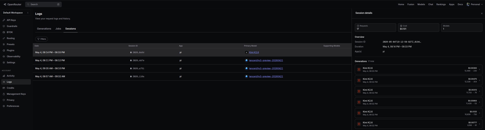

# pi-openrouter-session

A pi extension that automatically adds `session_id` to OpenRouter API requests, enabling you to track and group conversations in the OpenRouter console.

## Overview

When using pi with OpenRouter as your LLM provider, each request is typically treated as an isolated interaction. OpenRouter supports a `session_id` field in the request body that groups related requests together in their console/dashboard.

This extension automatically:
- Captures your pi session ID (from the session file name)
- Injects the `session_id` field into every OpenRouter API request
- Allows you to view conversation threads in the OpenRouter console



## Why Use This?

- **Conversation Tracking**: View your pi sessions as grouped conversations in OpenRouter's dashboard
- **Cost Analysis**: Better understand token usage and costs per session rather than per-request
- **Debugging**: Easily trace a series of related API calls in the OpenRouter console
- **Session Continuity**: Maintain logical grouping even across multiple model calls within one pi session

## Installation

### Prerequisites

- [pi](https://pi.dev) installed (`npm install -g @mariozechner/pi-coding-agent`)
- An [OpenRouter API key](https://openrouter.ai/keys)

### Method 1: Install from npm (Recommended)

```bash
pi install npm:pi-openrouter-session
```

To install a specific version:

```bash
pi install npm:pi-openrouter-session@0.0.3
```

### Method 2: Install from GitHub

```bash
pi install git:github.com/odonnell-anthony/pi-openrouter-session
```

To install a specific version:

```bash
pi install git:github.com/odonnell-anthony/pi-openrouter-session@v0.0.3
```

### Method 3: Local Install (Development)

```bash
git clone git@github.com:odonnell-anthony/pi-openrouter-session.git
pi install /path/to/pi-openrouter-session
```

### Method 4: Project-Local Install

To share the extension with your team via project settings:

```bash
pi install -l npm:pi-openrouter-session
```

This writes to `.pi/settings.json` instead of your global settings.

## Usage

### 1. Set Your OpenRouter API Key

```bash
export OPENROUTER_API_KEY="sk-or-v1-..."
```

Or add it to `~/.pi/agent/auth.json`:

```json
{
  "openrouter": {
    "type": "api_key",
    "key": "sk-or-v1-..."
  }
}
```

### 2. Start pi with OpenRouter

```bash
pi --provider openrouter --model "openrouter/anthropic/claude-sonnet-4"
```

Or select OpenRouter interactively:
1. Start `pi`
2. Press `Ctrl+L` to open the model selector
3. Choose an OpenRouter model (e.g., `openrouter/anthropic/claude-sonnet-4`)

### 3. Verify the Extension is Working

When you start pi, you should see:
```
[openrouter-session] Using session_id: abc123def456
```

Or check for the notification: "OpenRouter session tracking enabled"

### 4. View Sessions in OpenRouter Console

1. Visit [OpenRouter Console](https://openrouter.ai/console)
2. Navigate to the activity/sessions section
3. Your pi conversations will be grouped by session ID

## How It Works

### Technical Implementation

The extension uses pi's extension API to:

1. **Capture Session ID** (`session_start` event):
   - Extracts the session identifier from the pi session file (e.g., `abc123.jsonl` → `abc123`)
   - Falls back to generating a random ID for ephemeral sessions (`--no-session`)

2. **Intercept API Requests** (`before_provider_request` event):
   - Detects OpenRouter requests by checking:
     - Model string contains `openrouter/`
     - Current model's provider is `openrouter`
   - Adds `session_id` to the request payload body

3. **Lifecycle Management**:
   - Session ID persists for the entire pi session
   - New session → new OpenRouter `session_id`
   - Fork/clone/create new session → new `session_id`

### Request Flow

```
User sends prompt
    ↓
pi builds OpenRouter API request
    ↓
Extension intercepts (before_provider_request)
    ↓
Adds session_id to payload
    ↓
Request sent to OpenRouter with session tracking
```

## Configuration

Currently, the extension works automatically with no configuration required.

### Advanced: Custom Session ID (Future Enhancement)

If you want to set a custom session ID, you could modify the extension to read from an environment variable:

```bash
export PI_OPENROUTER_SESSION_ID="my-custom-session"
```

Then modify `openrouter-session.ts` to check for this variable.

## Troubleshooting

### Extension Not Loading

1. Check if it's installed:
   ```bash
   pi list
   ```
   Should show `npm:pi-openrouter-session` (or `git:github.com/odonnell-anthony/pi-openrouter-session` if installed from GitHub)

2. Reload extensions in pi:
   ```
   /reload
   ```

3. Check the logs for:
   ```
   [openrouter-session] Using session_id: ...
   ```

### session_id Not Appearing in OpenRouter

1. Verify you're using an OpenRouter model:
   ```
   /model
   ```
   Should show `openrouter/...`

2. Check that `OPENROUTER_API_KEY` is set correctly

3. Enable debug logging and check the request payload

### Extension Conflicts

If you have other extensions modifying OpenRouter requests, ensure they don't remove the `session_id`. The `before_provider_request` handlers run in extension load order.

## File Structure

```
pi-openrouter-session/
├── package.json              # Pi package manifest
├── README.md                # This file
└── extensions/
    └── openrouter-session.ts  # The extension code
```

## Development

To modify the extension:

1. Clone the repo:
   ```bash
   git clone git@github.com:odonnell-anthony/pi-openrouter-session.git
   cd pi-openrouter-session
   ```

2. Make your changes to `extensions/openrouter-session.ts`

3. Test locally:
   ```bash
   pi install /path/to/pi-openrouter-session
   ```

4. Reload in pi: `/reload`

5. Push changes:
   ```bash
   git add .
   git commit -m "Your changes"
   git push origin main
   ```

## Limitations

- **Ephemeral Sessions**: Sessions started with `--no-session` get a random ID that can't be recovered
- **Session File Dependent**: The session ID is derived from the pi session file name. If you delete/rename the file, the ID changes
- **OpenRouter Only**: This only works with the OpenRouter provider

## Contributing

Contributions are welcome! Please:

1. Fork the repository
2. Create a feature branch (`git checkout -b feature/amazing-feature`)
3. Commit your changes (`git commit -m 'Add amazing feature'`)
4. Push to the branch (`git push origin feature/amazing-feature`)
5. Open a Pull Request

## License

MIT

## Related Projects

- [pi](https://pi.dev) - The minimal terminal coding harness
- [OpenRouter](https://openrouter.ai) - Unified API for LLM access
- [pi-mono](https://github.com/badlogic/pi-mono) - Pi's source code and documentation

## Support

- Open an issue on [GitHub](https://github.com/odonnell-anthony/pi-openrouter-session/issues)
- Check pi's [documentation](https://pi.dev/docs)
- Join the pi [Discord community](https://discord.com/invite/3cU7Bz4UPx)
